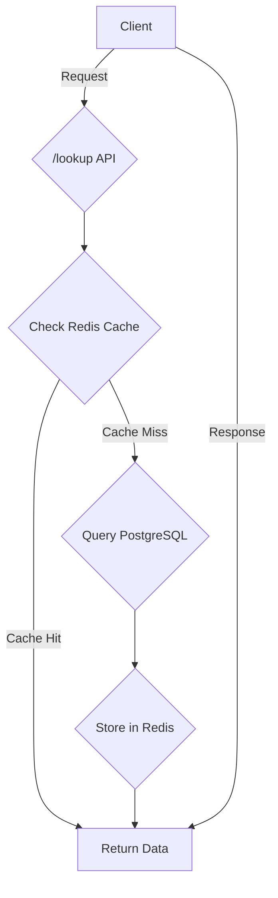

# ONDC POC Lookup Service

This project is a proof-of-concept (POC) for an ONDC (Open Network for Digital Commerce) lookup service. It provides a simple API to look up participant information.

## Architecture

The application follows a simple, layered architecture designed for performance and scalability. It utilizes a cache-aside pattern with Redis to minimize database lookups and reduce response times.

### Request Flow

1.  A client sends a request to the `/lookup` API endpoint.
2.  The application's handler first attempts to retrieve the requested data from the Redis cache.
3.  **Cache Hit:** If the data is found in Redis, it is immediately returned to the client.
4.  **Cache Miss:** If the data is not in the Redis cache, the application queries the PostgreSQL database to find the participant information.
5.  The data retrieved from PostgreSQL is then stored in the Redis cache for subsequent requests.
6.  The data is returned to the client.

This approach ensures that frequently accessed data is served quickly from memory (Redis), while the PostgreSQL database acts as the persistent source of truth.



## Project Structure

```
ondc_poc/
├── .env                # Environment variables
├── go.mod              # Go module definition
├── go.sum              # Go module checksums
├── cmd/
│   └── api/
│       └── main.go     # Application entry point
└── internal/
    ├── auth/
    │   ├── auth.go     # Authentication logic
    │   └── crypto.go   # Cryptographic functions
    ├── database/
    │   └── database.go # Database connection and queries
    ├── handlers/
    │   └── handlers.go # HTTP request handlers
    ├── models/
    │   └── models.go   # Data models/structs
    └── registry/
        └── registry.go # ONDC registry logic
```

## Getting Started

### Prerequisites

*   [Go](https://golang.org/dl/) (version 1.18 or later)
*   [Docker](https://www.docker.com/get-started)
*   A running PostgreSQL instance
*   A running Redis instance

### Setup

1.  **Clone the repository:**
    ```bash
    git clone <repository-url>
    cd ondc_poc
    ```

2.  **Create the environment file:**
    Create a `.env` file in the root of the project and add the following environment variables:

    ```env
    DB_HOST=localhost
    DB_PORT=5432
    DB_USER=your_db_user
    DB_PASSWORD=your_db_password
    DB_NAME=your_db_name
    REDIS_ADDR=localhost:6379
    ```
    *Update the values to match your PostgreSQL and Redis configurations.*

3.  **Database Setup:**
    Connect to your PostgreSQL database and create the necessary table:

    ```sql
    CREATE TABLE participants (
        id SERIAL PRIMARY KEY,
        subscriber_id VARCHAR(255) NOT NULL,
        status VARCHAR(50) NOT NULL,
        ukid VARCHAR(255) NOT NULL UNIQUE,
        subscriber_url VARCHAR(255) NOT NULL,
        country VARCHAR(10) NOT NULL,
        domain VARCHAR(50) NOT NULL,
        valid_from TIMESTAMPTZ NOT NULL,
        valid_until TIMESTAMPTZ NOT NULL,
        type VARCHAR(50) NOT NULL,
        signing_public_key TEXT NOT NULL,
        encr_public_key TEXT NOT NULL,
        created TIMESTAMPTZ NOT NULL DEFAULT NOW(),
        updated TIMESTAMPTZ NOT NULL DEFAULT NOW(),
        br_id VARCHAR(255),
        city VARCHAR(50) NOT NULL
    );
    ```

    You can insert some sample data:
    ```sql
    INSERT INTO participants (subscriber_id, status, ukid, subscriber_url, country, domain, valid_from, valid_until, type, signing_public_key, encr_public_key, br_id, city) VALUES
    ('buyerapp.com', 'SUBSCRIBED', 'UKID001', 'https://buyerapp.com/ondc', 'IND', 'ONDC:RET10', NOW(), NOW() + INTERVAL '4 year', 'BPP', 'key1', 'key2', 'br1', 'std:080'),
    ('sellerapp.com', 'SUBSCRIBED', 'UKID002', 'https://sellerapp.com/ondc', 'IND', 'ONDC:RET10', NOW(), NOW() + INTERVAL '4 year', 'BAP', 'key3', 'key4', 'br2', 'std:080'),
    ('logistics.com', 'SUBSCRIBED', 'UKID003', 'https://logistics.com/ondc', 'IND', 'ONDC:LOG10', NOW(), NOW() + INTERVAL '4 year', 'LSP', 'key5', 'key6', 'br3', 'std:080'),
    ```

### Running the Application

1.  **Start the server:**
    Open a terminal in the project's root directory and run:

    ```bash
    go run ./cmd/api
    ```

2.  The server will start on port `8080`. You will see log messages indicating successful connections to the database and Redis.

## API Endpoints

### Lookup

This endpoint functions like a "vlookup" to find participant information.

*   **URL:** `/lookup`
*   **Method:** `POST`
*   **Body (JSON):**

    ```json
    {
        "subscriber_id": "subscriber-1",
        "country": "IND",
        "domain": "retail"
    }
    ```

*   **Success Response (200 OK):**

    ```json
    [
        {
            "subscriber_id": "subscriber-1",
            "country": "IND",
            "city": "Bengaluru",
            "domain": "retail",
            "type": "BAP",
            "status": "SUBSCRIBED"
        }
    ]
    ```

*   **Error Response (500 Internal Server Error):**
    If no participants are found or if there is a system error.
    ```json
    {
        "error": "Failed to find participants: <error-details>"
    }
    ```
